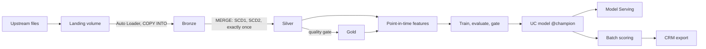

# Bronze to Served

**An end-to-end Databricks lakehouse and ML platform you can read, run and test: raw files in, governed tables and a served model out, and a visual designer that generates the jobs.**

[](https://aboualyxcode.github.io/bronze-to-served/)
[](https://github.com/aboualyXcode/bronze-to-served/actions/workflows/ci.yml)


Stagedoor is a fictional ticketing company that runs its data platform on Databricks. Four upstream systems drop realistic, messy files every day: order events, CRM change data capture, web and app clickstream, and show and venue snapshots. This repository takes them from a Unity Catalog volume through **Bronze, Silver and Gold**, builds **point-in-time features**, trains a **churn model**, promotes it only when it beats the champion, **serves** it, scores customers daily, watches for **drift**, and exports high-risk customers to the CRM.

Every job is generated by a **visual pipeline designer** whose palette is the platform's own component catalog, and the Spark pipeline is checked **row for row against an independent reference implementation**.

**[▶ Open the pipeline designer](https://aboualyxcode.github.io/bronze-to-served/)**


## Contents

- [What's inside](#whats-inside)
- [Quick start](#quick-start)
- [Architecture](#architecture)
- [The jobs](#the-jobs)
- [Repository structure](#repository-structure)
- [Testing](#testing)
- [The guide](#the-guide)
- [Contributing](#contributing)
- [Credits](#credits)

## What's inside

| Area | What it shows |
|---|---|
| **Ingestion** | Auto Loader with explicit schemas and rescued data, `COPY INTO` for snapshots, Kafka, CDC files, a deterministic generator that drops one realistic day at a time |
| **Silver** | order-independent SCD1, SCD Type 2 from CDC in one MERGE, exactly-once events, `try_cast` parsing, expectations with quarantine, a quality gate |
| **Gold** | a star schema with point-in-time dimension keys, revenue and refunds booked on their own dates, high-water-mark incremental recompute with `replaceWhere` |
| **Streaming** | `availableNow` and processing-time triggers, idempotent `foreachBatch`, watermarks and windows, a continuous job on classic compute |
| **Declarative** | the same flows as a Lakeflow Declarative Pipeline: expectations, AUTO CDC, a materialized view, a file arrival trigger |
| **ML** | a time-series feature table, out-of-time evaluation, MLflow with dataset lineage, Unity Catalog models, a champion/challenger gate, aliases and rollback, Model Serving, batch scoring, PSI drift, reverse ETL from the change data feed |
| **Governance** | Unity Catalog as code, contracts with comments, keys and clustering, grants by persona, PII tags, masking and row filters, lineage from system tables |
| **Delivery** | Databricks Asset Bundles with dev, staging and prod targets, seven jobs, serverless and classic compute, GitHub Actions CI/CD |
| **Designer** | a browser editor that checks designs and writes the bundle YAML; the repository's own jobs are made with it |

The [scenario catalog](docs/scenarios.md) lists all 41 scenarios with the code, the job and the test for each.

## Quick start

**In a Databricks workspace.** Add this repository as a Git folder (*Workspace > Create > Git folder*), open `notebooks/00_quickstart.py`, set the `catalog` widget to a catalog where you can create schemas, and *Run all*. It creates the Unity Catalog objects, lands a year of simulated files, and runs every layer through to a registered, scored churn model, step by step, on serverless or any Unity Catalog cluster.

**As a deployed platform.**

```sh
pip install build                                   # the bundle builds the wheel
databricks auth login --host https://<your-workspace>
databricks bundle deploy -t dev --var catalog=<your_catalog>
databricks bundle run -t dev stagedoor_setup        # objects and a year of simulated files
databricks bundle run -t dev stagedoor_platform     # one daily run: Bronze to Gold, scoring, drift
databricks bundle run -t dev stagedoor_ml_training  # features, train, evaluate, promote if better
```

Run `stagedoor_platform` again to land and process the next simulated day.

**On your laptop.**

```sh
git clone https://github.com/aboualyXcode/bronze-to-served.git
cd bronze-to-served
pip install -e ".[ml,local,dev]"      # local Spark with Delta Lake (needs Java 17)
make data local                       # generate files and run the daily job's DAG locally
make test                             # unit and designer tests
make designer                         # the pipeline designer on http://localhost:8000
```

## Architecture



Each task is a **component** declared once with the tables it reads and writes. That declaration drives the `b2s` CLI that every job task calls, the designer's palette and its *Wire by lineage*, and the bundle tests. [Chapter 1](docs/01-architecture.md) walks through it.

## The jobs

| Job | Trigger | What it runs |
|---|---|---|
| `stagedoor_setup` | manual | Unity Catalog objects, simulated history, optional governance (condition task) |
| `stagedoor_platform` | daily | land, Bronze, Silver, quality gate, Gold, features, scoring, drift, CRM export |
| `stagedoor_ml_training` | weekly | features and labels, train, evaluate, validation notebook, gate, promote, deploy |
| `stagedoor_streaming` | continuous | clickstream Bronze, Silver and live engagement with processing-time triggers |
| `stagedoor_maintenance` | weekly | OPTIMIZE, VACUUM and ANALYZE over nine tables with a for-each task |
| `stagedoor_declarative_refresh` | file arrival | refresh the Lakeflow Declarative Pipeline |
| `stagedoor_ml_rollback` | manual | swap the champion back and redeploy the endpoint |

## Repository structure

```text
databricks.yml              the bundle: variables, the wheel, dev / staging / prod targets
resources/                  7 jobs (generated by the designer) and the declarative pipeline
src/bronze_to_served/
  config.py                 every catalog, schema, table, volume and checkpoint name
  core/                     reusable: contracts, quality, ingestion, streams, MERGE patterns, Delta ops, UC, audit
  stagedoor/                the domain: generator, rules, tables, Bronze, Silver, Gold, features, setup, operations
  ml/                       model, promotion policy, drift, registry, serving, batch scoring, ML tasks
  tasks/                    component catalog, the b2s CLI, task context, local DAG runner
notebooks/                  quickstart, layer explorers, ML walkthrough, governance, the validation gate
pipelines/                  the Lakeflow Declarative Pipeline
designer/                   the visual pipeline designer, its job templates, build script and tests
tests/unit/                 pure-Python tests (no Spark)
tests/spark/                Spark and Delta tests: MERGE patterns, differential, incremental
tests/reference/            the independent reference implementation (Python and SQLite)
docs/                       the guide, the scenario catalog and the data dictionary
.github/workflows/          CI and deployment
```

## Testing

```sh
pytest tests/unit            # 57 tests: generator, oracle, config, contracts, quality, catalog, CLI, ML, bundle
node designer/tests/run.js   # designer rules and checks; committed YAML matches the templates
pytest tests/spark           # MERGE edge cases; the pipeline matches the reference row for row; daily runs = one run
```

The differential test runs the daily and training jobs **from the same templates that generate the deployed jobs**, then compares every Silver and Gold table, the quarantine, the features and the labels with `tests/reference/oracle.py`, which implements them a second way: Silver as an event-by-event Python replay instead of set-based MERGE, Gold and the features as SQL over SQLite instead of DataFrames. Databricks-only features (Auto Loader, `COPY INTO`, the MLflow registry, Model Serving, Lakeflow) run in the staging deployment. GitHub Actions runs everything; [chapter 10](docs/10-testing.md) explains what each suite proves.

## The guide

1. [Architecture](docs/01-architecture.md): the platform end to end and how components connect
2. [Unity Catalog and governance](docs/02-unity-catalog.md): layout, contracts, grants, masking, lineage
3. [Ingestion](docs/03-ingestion.md): Auto Loader, COPY INTO, Kafka, CDC, schema drift
4. [The medallion](docs/04-medallion.md): SCD1, SCD2, exactly-once, quarantine, star schema, late data
5. [Streaming](docs/05-streaming.md): triggers, checkpoints, idempotency, watermarks, continuous jobs
6. [Declarative pipelines](docs/06-declarative-pipelines.md): the same flows declared, and when to choose which
7. [The ML lifecycle](docs/07-ml-lifecycle.md): point-in-time features to a served, monitored model
8. [Orchestration and CI/CD](docs/08-orchestration-and-cicd.md): jobs, task types, targets, GitHub Actions
9. [The pipeline designer](docs/09-pipeline-designer.md): designing jobs and generating bundle YAML
10. [Testing](docs/10-testing.md): unit, Spark, differential, and what needs a workspace

## Contributing

- **A component:** write `def task(ctx) -> dict`, declare it in `src/bronze_to_served/tasks/catalog.py` with its reads and writes, run `make generate`, and use it in a design.
- **A job:** design it in the designer, save the JSON in `designer/templates/`, run `make generate`. CI fails if the YAML and its template disagree.
- **A rule or a table:** change the pipeline and the reference implementation together, and extend `tests/spark/test_differential.py`.

## Credits

Created by [Mahmoud Aboualy](https://github.com/aboualyXcode).

Typefaces: Albert Sans and Red Hat Mono from Google Fonts. Stagedoor is fictional. Databricks, Delta Lake and MLflow are trademarks of their owners; this project is not affiliated with them.
