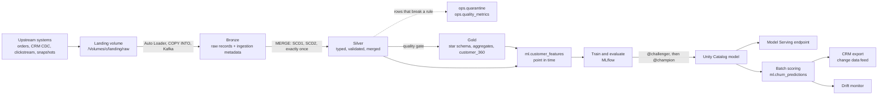

# 1. Architecture

Stagedoor sells concert tickets. Four upstream systems drop files every day: the ticketing system (order events), the CRM (customer changes as CDC), the web and app tracker (clickstream) and the scheduling system (snapshots of shows and venues). Bronze to Served turns those files into governed tables, a churn model that is retrained, gated and served, and the jobs that keep all of it fresh.



## What each layer promises

| Layer | Tables | Promise |
|---|---|---|
| Landing | files in a volume | Nothing: whatever upstream sent, as it sent it. |
| Bronze | `*_raw` | Every record that arrived, unchanged (all strings), with where and when it came from. Never fails on bad data. |
| Silver | `orders`, `order_items`, `customers`, `clickstream`, `events`, `venues` | Typed, valid, one row per key (or per version for SCD2). Replays, retries and duplicates change nothing. |
| Gold | `dim_*`, `fct_sales`, `agg_daily_sales`, `event_performance`, `customer_360`, `funnel_daily` | Business definitions in one place, rebuilt reproducibly from Silver. |
| ML | features, labels, training set, evaluations, predictions, drift | Point-in-time correct; every model traces back to its training table. |
| Ops | quarantine, quality metrics, task runs, export bookmarks | What happened in each run, and what needs fixing. |

The [data dictionary](data-dictionary.md) lists every table and column; it is generated from the contracts in `src/bronze_to_served/stagedoor/tables.py`.

## How the components connect

Every task the platform can run is a **component** in `src/bronze_to_served/tasks/catalog.py`, declared with the tables it `reads` and `writes`:

```python
Component("silver.customers", "Customers (SCD2)", "silver", "python",
          "Apply CRM changes in LSN order as SCD Type 2 history; deletes close the current version.",
          f"{S}.silver:customers", reads=("bronze.customers_cdc_raw",),
          writes=("silver.customers", "ops.quarantine", "ops.quality_metrics"), ...)
```

That single declaration drives three things, so they cannot disagree:

- **The `b2s` CLI**, which every Databricks job task calls: `b2s --task silver.customers --catalog ...`.
- **The pipeline designer**, whose palette is generated from the catalog and whose *Wire by lineage* connects a task to every task that writes what it reads ([chapter 9](09-pipeline-designer.md)).
- **The bundle tests**, which fail if a job names a component that does not exist ([chapter 10](10-testing.md)).

Jobs are designs: `designer/templates/*.json` lists components and dependencies, and `node designer/scripts/build.js` turns each into `resources/<job>.job.yml`. The daily job runs in nine stages:

```text
1. simulate_upstream_drop
2. bronze_orders, bronze_customers, bronze_clickstream, bronze_reference      (4 in parallel)
3. silver_orders, silver_customers, silver_clickstream, silver_reference      (4 in parallel)
4. quality_gate
5. gold_dimensions, gold_funnel
6. gold_sales
7. gold_event_performance, gold_customer_360, ml_features
8. batch_scoring
9. drift_monitor, crm_export
```

## Unity Catalog layout

```text
<catalog>                      stagedoor_dev | stagedoor_staging | stagedoor_prod
  <prefix>landing              volume raw: the files upstream drops
  <prefix>bronze               orders_raw, customers_cdc_raw, clickstream_raw, events_raw, venues_raw
  <prefix>silver               orders, order_items, customers, clickstream, events, venues
  <prefix>gold                 dim_customer, dim_event, fct_sales, agg_daily_sales, event_performance, ...
  <prefix>ml                   customer_features, churn_labels, ..., model churn_model
  <prefix>ops                  quarantine, quality_metrics, task_runs, export_bookmarks; volumes checkpoints, exports
  <prefix>declarative          the same flows built by Lakeflow Declarative Pipelines
```

In dev, `<prefix>` is your user name (`alice_silver`), so developers never overwrite each other. `PlatformConfig` (`src/bronze_to_served/config.py`) is the only place names are built.

## One codebase, three places to run

| Where | How | For |
|---|---|---|
| A Databricks job | a Python wheel task calling `b2s --task <component>` | production, on serverless or classic compute |
| A Databricks notebook | `run_task(...)` with the notebook's Spark session, importing `../src` | the quickstart and exploration |
| Your laptop or CI | `PlatformConfig.local(...)` with open-source Spark and Delta Lake | tests, and running whole job DAGs locally |

The local runtime replaces three Databricks-only features with equivalents: Auto Loader with Spark's file source, `COPY INTO` with an anti-join on the source file, and Unity Catalog with two-level table names (no primary keys or liquid clustering). [Chapter 10](10-testing.md) lists what each environment can and cannot verify.

## Reading the code

The shortest path through the repository:

1. `config.py`: every name in the platform.
2. `stagedoor/datagen.py`: what the raw data looks like, and the contracts upstream keeps.
3. `core/contracts.py` and `stagedoor/tables.py`: tables as code.
4. `stagedoor/bronze.py`, `silver.py`, `gold.py`, `features.py`: the pipeline, layer by layer.
5. `core/merge.py`: the MERGE patterns that make Silver idempotent.
6. `ml/`: training, the promotion policy, the registry, serving, scoring and drift.
7. `tasks/catalog.py` and `tasks/cli.py`: how jobs call all of the above.
8. `tests/reference/oracle.py`: the same logic written a second, independent way.

**Practise:** run `notebooks/00_quickstart.py` and watch the tables appear layer by layer.
