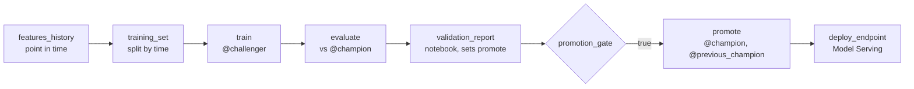

# 7. The ML lifecycle

The model answers one question: **will this customer buy nothing in the next 60 days?** Getting it into production safely is mostly about data and process, not algorithms: features must use only the past, evaluation must look like the future, and a new model must earn its promotion.

## Point-in-time features

A feature row `(customer, as_of_date)` describes the customer at the end of that day, using only what was known then (`stagedoor/features.py`):

| Feature | Uses |
|---|---|
| `recency_days`, `orders_30d/90d/365d`, `revenue_90d/365d` | orders **paid** on or before the date (`paid_at`, not today's status) |
| `refunds_365d` | refunds made on or before the date (`refunded_at`) |
| `avg_ticket_price_365d`, `genres_365d` | paid order lines and the shows they were for |
| `events_7d`, `events_30d`, `cart_adds_30d`, `engagement_ratio` | app and web events up to the date |
| `loyalty_tier`, `marketing_opt_in`, `country`, `tenure_days` | the SCD2 customer version in effect at the end of the date |

Two Silver design decisions make this possible. Orders keep the time of every status change, so "paid by then" is answerable; a table holding only the latest status would leak future refunds into old rows. Customers keep full history, so the tier is the tier at the time, not today's.

The label looks forward: `churned = 1` if no paid order in `(as_of_date, as_of_date + 60 days]`. Snapshots are taken every 14 days, starting 90 days into the history, and only where the 60-day window is complete, so the newest labelled date is always 60 days before the newest data. The population is customers with a paid order in the year before the date who still exist (deleted customers drop out).

`ml.customer_features` has the primary key `(customer_id, as_of_date TIMESERIES)`, which makes it a time-series feature table in Unity Catalog, discoverable and usable for point-in-time lookups by other models.

## Training and evaluation

- **Split by time, not at random.** The latest 20% of as-of dates are the test set: the model is judged on a future it never saw, which is how it will be used. A random split would put the same customer's adjacent snapshots on both sides.
- **The model** (`ml/model.py`) is a scikit-learn pipeline: one-hot encoded tier and country, and a histogram gradient-boosted classifier, which handles missing values natively (a customer with no app events has no engagement ratio).
- **Metrics** cover ranking and calibration: ROC AUC, PR AUC, top-decile lift (who to call first), log loss and Brier score (whether 0.7 means 70%). On the generated data the model reaches an out-of-time ROC AUC around 0.8, because the generator's customers really do disengage before they churn.
- **Tracking**: each run logs parameters, metrics, the model with its signature and an input example, and the training table as an MLflow dataset, then registers the model in Unity Catalog and points the `@challenger` alias at the new version.

## Earning promotion

`ml.evaluate` scores the challenger and the current champion **on the same test set** and applies the promotion policy (`ml/policy.py`):

| Rule | Default |
|---|---|
| Floors | ROC AUC of at least 0.70, whatever else happens |
| Primary metric | PR AUC must not be worse than the champion's (`min_improvement` 0.0) |
| Guardrails | ROC AUC may drop by at most 0.01, Brier score may rise by at most 0.005 |
| No champion yet | passing the floors is enough |

Every evaluation, including the reasons for the decision, is appended to `ml.model_evaluations`. The `validation_report` notebook task renders the comparison (the run page keeps it, so every promotion has a readable record) and sets the task value `promote`; the `promotion_gate` condition task reads `{{tasks.validation_report.values.promote}}`, and `promote` runs only on its true branch. Override the policy per run with the `policy` parameter, for example `{"min_improvement": 0.01}`.

## Aliases, serving and rollback

Code never refers to a model version number; it refers to aliases:

| Alias | Means | Moved by |
|---|---|---|
| `@challenger` | the version just trained | `ml.train` |
| `@champion` | the version serving traffic and scoring customers | `ml.promote` |
| `@previous_champion` | the version to go back to | `ml.promote` |

`ml.deploy_endpoint` points a Model Serving endpoint (scale to zero) at the champion's version, creating the endpoint the first time; it is off in dev and on in staging and production. The model is logged with `pyfunc_predict_fn="predict_proba"`, so the endpoint returns probabilities. `stagedoor_ml_rollback` swaps `@champion` and `@previous_champion` and redeploys: one click back, and one click forward again.

## Scoring, monitoring and acting

- **Batch scoring** (`ml.batch_inference`, in the daily job) computes today's features, scores them with the champion inside `mapInPandas`, so scoring is distributed, and writes `ml.churn_predictions` with the model version. Without a champion yet, it skips instead of failing.
- **Drift** (`ml.drift`) compares each feature's distribution today with the training data using the population stability index: below 0.1 stable, up to 0.25 moderate, above that significant. Missing values are a bin of their own, so a feature that stops arriving is drift too. Set `fail_on_drift=true` to fail the run on significant drift.
- **Acting**: `serve.crm_export` reads only the predictions that changed since its last run (the change data feed, with a bookmark in `ops.export_bookmarks`) and writes high-risk customers to a file for the CRM.

The registry code works with MLflow 2 and 3 (it detects whether `log_model` takes `name` or `artifact_path`). Production teams often add Lakehouse Monitoring on the predictions table, online feature serving, and a traffic split between champion and challenger on the endpoint; each slots in after the tasks here.

**Practise:** run the training job twice. The second challenger ties the champion, so the gate's reasons in `ml.model_evaluations` explain why nothing was promoted.
