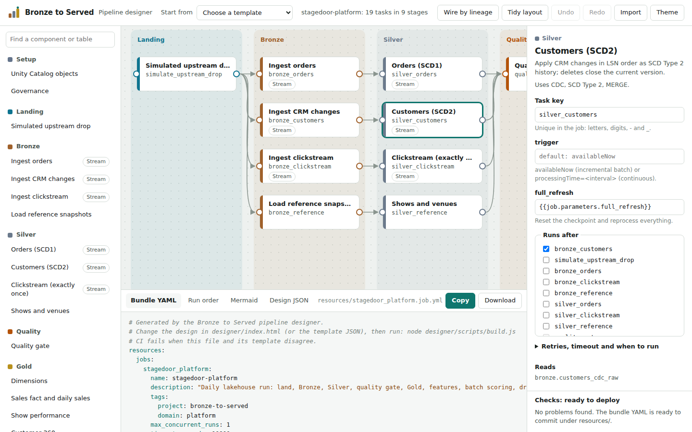

# 9. The pipeline designer

The designer (`designer/`) is a visual editor for Databricks jobs. You place platform components on a canvas, connect them, and it checks the design and writes the Asset Bundle YAML that deploys it. It is how this repository's own jobs are made: every file in `resources/*.job.yml` is generated from a design in `designer/templates/`.



## Opening it

- **Locally:** open `designer/index.html` in a browser, or serve the folder with `python -m http.server --directory designer`.
- **On GitHub Pages:** [aboualyxcode.github.io/bronze-to-served](https://aboualyxcode.github.io/bronze-to-served/) (Settings > Pages > deploy from the `main` branch). The site root redirects to `/designer/`.
- **As one file:** `node designer/scripts/build.js` also writes `designer/dist/pipeline-designer.html`, everything inlined, to share or host anywhere.

Designs are saved in the browser as you work.

## What you can do

- **Add components** from the palette (click, or drag onto the canvas). The palette is generated from the component catalog, so it always matches what the platform can run; search by name, capability or table (`silver.orders`).
- **Connect tasks** by dragging from a task's right edge to the task that should run after it, or by ticking *Runs after* in the inspector.
- **Wire by lineage**: add every dependency implied by tables, so a task runs after each task that writes what it reads. It never adds a redundant or cyclic edge.
- **Edit** task keys, parameters (with suggestions for `{{job.parameters.*}}` and task values), retries, timeouts, `run_if` and for-each settings; and job settings: trigger (manual, schedule, file arrival, continuous), compute, parameters, notifications.
- **Branch** with a condition component; select an arrow leaving it to choose the true or false branch.
- **Read the output**: bundle YAML, the run order (stages that run in parallel), a Mermaid diagram for pull requests and docs, and the design as JSON. Copy or download each.

Columns follow dependency depth, so arrows always flow left to right, and each column is tinted by the layer of its tasks: the medallion is visible in the shape of the job.

## The checks

Errors stop a design from deploying correctly; warnings flag designs that deploy but probably do the wrong thing.

| Check | Level | Catches |
|---|---|---|
| `cycle` | error | tasks that depend on each other in a loop |
| `duplicate-key`, `task-key` | error | task keys that are repeated or invalid |
| `job-key-clash` | error | a job key that is already a pipeline's bundle key (resource keys must be unique across types) |
| `job-params`, `job-param-ref` | error | Python tasks without `catalog` and `schema_prefix`, references to undefined job parameters |
| `condition`, `outcome` | error | incomplete conditions; outcomes on arrows that do not leave a condition |
| `task-value`, `task-value-order` | error | reading a task value from a task that is missing or does not run first |
| `serverless-trigger` | error | a processing-time stream on serverless compute |
| `for-each`, `required-param` | error | for-each inputs that are not a JSON array; a maintenance task without a table |
| `missing-dependency` | warning | a task that reads a table another task writes, without running after it |
| `concurrent-writers` | warning | two tasks that write the same table and may run at the same time |
| `layer-skip` | warning | Gold, ML or serving tasks reading raw data |
| `ungated-promotion` | warning | promoting a model without a validation gate |
| `setup-scheduled`, `orphan` | warning | one-off setup on a schedule; disconnected tasks |

The same rules run in the browser and in `designer/tests/run.js`, which also requires every template to pass with no warnings.

## From design to deployment

A Python component becomes a wheel task with the platform's common parameters:

```yaml
- task_key: silver_customers
  description: Apply CRM changes in LSN order as SCD Type 2 history; deletes close the current version.
  depends_on:
    - task_key: bronze_customers
  max_retries: 1
  min_retry_interval_millis: 60000
  retry_on_timeout: false
  environment_key: default
  python_wheel_task:
    package_name: bronze_to_served
    entry_point: b2s
    named_parameters:
      task: silver.customers
      catalog: "{{job.parameters.catalog}}"
      schema_prefix: "{{job.parameters.schema_prefix}}"
      run_id: "{{job.run_id}}"
      full_refresh: "{{job.parameters.full_refresh}}"
```

Notebook components become notebook tasks, conditions become condition tasks, the declarative pipeline becomes a pipeline task, and a for-each node wraps its task in a `for_each_task`. Serverless jobs get environments; job-cluster jobs get a cluster and per-task libraries.

To change a job: open its template (*Start from*), edit, switch to *Design JSON*, save it over `designer/templates/<name>.json`, and run `node designer/scripts/build.js`. CI runs the same script with `--check` and fails if a committed YAML file and its template disagree, so the canvas and the deployment cannot drift apart. The Python side reads the same templates: `python -m bronze_to_served.tasks.local designer/templates/platform_daily.json` runs a whole job locally.

## Adding a component

1. Write the task: a function `def my_task(ctx: TaskContext) -> dict` that returns metrics.
2. Declare it in `src/bronze_to_served/tasks/catalog.py` with its layer, the tables it reads and writes, and its parameters.
3. Run `python -m bronze_to_served.tasks.catalog` to regenerate the palette (`designer/js/catalog.js`).
4. Use it in a design. `tests/unit/test_catalog.py` checks that the function exists and that its lineage names real tables.

## Where it fits

Databricks has its own visual tools: the Jobs UI draws and edits task graphs, Lakeflow Declarative Pipelines draw their dataset graph, and Databricks announced Lakeflow Designer, a no-code visual pipeline builder, in 2025 (check its availability in your workspace). This designer is complementary and code-first: it knows this platform's components and their lineage, checks platform-specific rules, and produces reviewable YAML that lives in git and deploys through CI.
